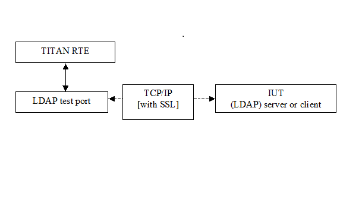

= LDAP Test Port for TTCN-3 Toolset with TITAN, Description
:author: Tamás Werner
:revnumber: 1551-CNL 113 385, Rev. B
:revdate: 2016-03-09
:toc:

= Functionality

The LDAP Test Port makes possible to execute test suites towards an IUT. The test port allows sending and receiving LDAP messages between the test suite and IUT via a TCP/IP or SSL.

The communication between the LDAP test port and the TITAN RTE is done by using the API functions described in <<_3, [3]>>. The LDAP protocol messages are then transferred by the LDAP test port to the IUT through a network connection.

See overview of communication between the LDAP test port and the TITAN RTE below:

== System Requirements

In order to operate the LDAP test port the following system requirements must be satisfied:

* Platform: any platform supported by TITAN RTE and OpenSSL
* TITAN TTCN-3 Test Executor version R8B (1.8.pl1 or higher) installed. For installation guide see <<_2, [2]>>.

NOTE: This version of the test port is not compatible with TITAN releases earlier than R8B.

* The Abstract_Socket CNL 113 384, rev. R7G or later product has to be installed.

If SSL is used, the same OpenSSL must be installed as used in TITAN. For installation guide see <<_5, [5]>>.

= Feature List

== Implementation

=== Environment

The LDAP test port makes use of the services provided by the UNIX socket interface. When connecting to an SSL enabled IUT, the connection is secured with the OpenSSL toolkit based on configuration data. The test port can work as a client (maintaining only one connection at a time) or as a server (maintaining several connections at the same time).

== Start Procedure

=== Server Mode

When the test port is mapped by TITAN RTE to the IUT system’s interface port, the server creates a TCP socket and starts listening on it. Depending on the transport channel specified in the runtime configuration file, it will accept either TCP or SSL connections.

=== Client Mode

When the test port is mapped by TITAN RTE to the IUT system’s interface port, the client creates a TCP socket and tries to connect to the server. If the transport channel is SSL, the client starts an SSL handshake once the TCP connection is established to the server. If the SSL handshake is successful, the SSL connection is setup and the map operation is finished.

[[sending-receiving-ldap-messages]]
== Sending/Receiving LDAP Messages

[[deviation-from-the-standard-ldap-asn-1-type-definition-module]]
=== Deviation from the standard LDAP ASN.1 type definition module

==== `LDAPString`, `LDAPOID`

Definition in <<_6, [6]>>:

[source]
----
LDAPString ::= OCTET STRING

LDAPOID ::= OCTET STRING
----

Definition in LDAP test port type definition module:

[source]
----
LDAPString ::= [UNIVERSAL 4] UTF8String

LDAPOID ::= [UNIVERSAL 4] UTF8String
----

Reason for deviation: the variables of type LDAPString and LDAPOID shall contain UTF-8 encoded character string. With this deviation the user gets rid of the need for UTF-8 encoding character strings. By applying a [UNIVERSAL 4] tag the ASN.1 tag of these types is the same as of OCTET STRING.

==== `AttributeValue`, `AssertionValue`

Definition in <<_4, [4]>>:

[source]
----
AttributeValue ::= OCTET STRING

AssertionValue ::= OCTET STRING
----

Definition in LDAP test port type definition module:

[source]
----
AttributeValue ::= CHOICE {
		string	UTF8String,
		binary	OCTET STRING
}

AssertionValue ::= CHOICE {
		string	UTF8String,

----

Reason for deviation:

According to <<_4, [4]>>, the value of a variable of type AttributeValue and AssertionValue can be interpreted as a UTF-8 encoded character string and arbitrary binary data, depending on the corresponding AttributeDescription. If the option `_binary_` is present in the AttributeDescription, then the value shall be interpreted as raw binary data, otherwise as a UTF-8 encoded character string.

On sending, this deviation enables the user to specify the value as character string. If `string` field is selected, the test port encodes the character string value according to UTF-8 and sends a standard LDAP message towards the SUT. However, if `_binary_` option is present, the test port issues a warning message.

On message reception the test port checks whether a `_binary_` option is present in the AttributeDescription accompanying each AttributeValue and AssertionValue. If `_binary_` option is not detected, the test port interprets the value as a UTF-8 encoded character string, otherwise as raw binary data. If `_binary_` option is not detected but the value is not a valid UTF-8 encoded string then dynamic test case error occurs.

==== Resolving TTCN-3 Name Clashes

Some names in <<_4, [4]>> are reserved words in TTCN-3. The following names were changed in order to allow usage in TTCN-3:

[cols=2*,options=header]
|===
|Standard name
|Changed name

|and
|andField

|or
|orField

|not
|notField

|any
|anyField

|type
|typeField

|replace
|replaceValue

|delete
|deleteValue

|add
|addValue

|===

=== LDAP Messages Sent by the Test Port to the TTCN-3 Test Suite

The LDAP test port is able to send _LDAPMessage_ and __ASP_LDAP_server__ structures.

* _LDAPMessage_ +
The _LDAPMessage_ structure contains an LDAP message. Test ports acting as a client, will always send this structure to the TTCN-3 test suite.
* __ASP_LDAP_server__ +
The __ASP_LDAP_server__ structure contains an optional client identifier and an LDAP message. The client identifier (which is an integer) is used to distinguish the clients. Test ports acting as a server, will always send this structure to the TTCN-3 test suite.
* __ASP_LDAP_closed__ +
The test port reports the closure of the connection. Sent only if the test port parameter `use_connection_ASPs` is set to `_"yes"_`.
* __ASP_LDAP_connect_result__ +
Contains the result of the connection attempt. The connection is failed if the `client_id` is `_-1_`. Sent only if the test port parameter `use_connection_ASPs` is set to `_"yes"_`.

NOTE: In case of TLS connection `ASP_LDAP_closed` message can come instead of `ASP_LDAP_connect_result` if connection was broken during the SSL handshake.

=== LDAP Messages Received by the Test Port from the TTCN-3 Test Suite

The LDAP test port is able to receive _LDAPMessage_ and _ASP_LDAP_server_ structures.

* _LDAPMessage_ +
The _LDAPMessage_ structure contains an LDAP message. Test ports acting as a client, will always accept this structure from the TTCN-3 test suite. Test ports acting as a server will not accept this structure.
* __ASP_LDAP_server__ +
The __ASP_LDAP_server__ structure contains an optional client identifier and an LDAP message. The client identifier (which is an integer) is used to distinguish the clients. Test ports acting as a server, will always accept this structure from the TTCN-3 test suite. Test ports acting as a client will not accept this structure.
* __ASP_LDAP_connect__ +
Open a TCP/TLS connection to the remote server. In client mode the test port closes the existing connection first. If the remote address/port is not specified, the settings from the configuration file will be used.

== Logging

The type of information that will be logged can be categorized into two groups. The first one consists of information that shows the flow of the internal execution of the test port, e.g. important events, which function that is currently executing etc. The second group deals with presenting valuable data, e.g. presenting the content of a PDU. The logging printouts will be directed to the RTE log file. The user is able to decide whether logging is to take place or not by setting appropriate configuration data, see *Error! Reference source not found.*.

== Error Handling

Erroneous behavior detected during runtime is directed into the RTE log file. The following two types of messages are taken care of:

* Errors: +
Information about errors detected is provided. If an error occurs the execution of the test case will stop immediately. The test ports will be unmapped.
* Warnings: +
Information about warnings detected is provided. The execution continues after the warning is shown.

== Closing Down

The connection can be shut down performing the `unmap`() operation on the port.

NOTE: Port message queue is not cleared by `unmap`() or `map`() operations. So if port was unmapped and mapped again, but connection was broken from remote side, message queue will still contain `ASP_LDAP_closed` message. This situation frequently occurs when `Unbind` request was sent before port unmapping. To clear port message queue manually, _clear_ function from <<_1, [1]>> can be used.

== SSL Functionality

The test port can use SSL or TCP as the transport channel. The SSL implementation is based on the same OpenSSL as TITAN (OpenSSL 0.9.7d).

The protocols SSLv2, SSLv3 and TLSv1 are supported.

=== Authentication

The test port provides both server side and client side authentication. When authenticating the other side, a certificate is requested and the own trusted certificate authorities’ list is sent. The received certificate is verified whether it is a valid certificate or not (the public and private keys are matching). No further authentication is performed (e.g. whether hostname is present in the certificate). The verification can be enabled/disabled in the runtime configuration file.

In server mode the test port will always send its certificate and trusted certificate authorities’ list to its clients. If verification is enabled in the runtime configuration file, the server will request for a client’s certificate. If the client does not send a valid certificate, the connection will be refused. If verification is disabled, then the connection will be accepted even if the client does not send or send an invalid certificate.

In client mode the test port will send its certificate to the server on the server’s request. If verification is enabled in the runtime configuration file, the client will send its own trusted certificate authorities’ list to the server and will verify the server’s certificate as well. If the server’s certificate is not valid, the SSL connection will not be established. If verification is disabled, then the connection will be accepted even if the server does not send or send an invalid certificate.

The own certificate(s), the own private key file, the optional password protecting the own private key file and the trusted certificate authorities’ list file can be specified in the runtime configuration file.

The test port will check the consistency between the own private key and the public key (based on the own certificate) automatically. If the check fails, a warning is issued and execution continues.

=== Other Features

Both client and server support SSLv2, SSLv3 and TLSv1, however no restriction is possible to use only a subset of these. The used protocol will be selected during the SSL handshake automatically.

The usage of SSL session resumption can be enabled/disabled in the runtime configuration file.

The allowed ciphering suites can be restricted in the runtime configuration file.

The SSL `rehandshaking` requests are accepted and processed, however `rehandshaking` cannot be initiated from the test port.

=== Limitations

* No restriction is possible on the used protocols (e.g. use only SSLv2), it is determined during SSL handshake between the peers.
* SSL `rehandshaking` cannot be initiated from the test port.
* The own certificate file(s), the own private key file and the trusted certificate authorities’ list file must be in PEM format. Other formats are not supported.

== LDIF Support

The support contains 5 functions.

* __f_ImportLDIF__ +

* __f_ExportLDIF__ +
Exports data to an LDIF file.

* __f_PopulateLDAPServer__ and __f_DepopulateLDAPServer__
They are for populating and depopulating LDAP servers. Depopulation performs LDAP Delete only for each entry found in the LDIFData structure, but does nothing for changerecords.

* __f_PopulateLDAPServer_2__ and __f_DepopulateLDAPServer_2__
They are also for populating and depopulating LDAP servers. Depopulation works for every type of entries and restore the original state of the LDAP Server.

[[encoder-decoder-functions]]
== Encoder/Decoder Functions

This product also contains encoding/decoding functions that assure correct encoding of messages when sent from Titan and correct decoding of messages when received by Titan.

Implemented encoding/decoding functions:

[cols=3*,options=header]
|===
|Name
|Type of formal parameters
|Type of return value

|f_decode_LDAPMessage|in octetstring data +
out LDAPMessage pdu)|return integer;

|f_encode_LDAPMessage|in LDAPMessage pdu|return octetstring;
|===

= The Test Port

== Overview

The LDAP test port offers LDAP message primitives to the test suite in TTCN-3 format. The TTCN-3 definition of the LDAP messages can be found in a separate TTCN-3 module. This module should be imported into the test suite. For more information on LDAP see <<_4, [4]>>.

The LDAP test port also offers LDIF importation, population, depopulation functionality. For more information on LDIF see <<_6, [6]>>.

== Installation

Since the LDAP test port is used as a part of the TTCN-3 test environment this requires TTCN-3 Test Executor to be installed before any operation of the LDAP test port. For more details on the installation of TTCN-3 Test Executor see the relevant section of <<_2, [2]>>.

The compilation of SSL related code parts can be disabled by not defining the __AS_USE_SSL__ macro in the _Makefile_ during the compilation.

When building the executable test suite the libraries compiled for the OpenSSL toolkit (if the _AS_USE_SSL_ macro is defined) and the TTCN-3 Test Executor should also be linked into the executable. For more information see <<_2, [2]>>.

NOTE: If you are using the test port on Solaris, you have to set the _PLATFORM_ macro to the proper value. It shall be `_SOLARIS_` in case of Solaris 6 (SunOS 5.6) and `_SOLARIS8_` in case of Solaris 8 (SunOS 5.8).

== Configuration

The executable test program behavior is determined via the run-time configuration file. This is a simple text file, which contains various sections (e.g. `[TESTPORT_PARAMETERS]`) after each other. The usual suffix of configuration files is _.cfg_.

=== LDAP Test Port Parameters in the Test Port Configuration File

The test port uses abstract socket, therefore the abstract socket’s parameters also apply when using the LDAP test port.

=== LDIF Module Parameters in the Configuration File

`tsp_delayAfterPopulation`

This is an optional parameter. It is used in case of LDIF support feature (see <<LDIF_support, LDIF Support>>). The value of this parameter determines the delay in seconds at the end of functions __f_PopulateLDAPServer__, __f_DepopulateLDAPServer__, __f_PopulateLDAPServer_2__ and __f_DepopulateLDAPServer_2__. If it is `_0.0_`, then there is no delay.

The default value is `_1.0_`.
 [[LDIF_support]]
== LDIF Support

=== External Function for LDIF Import

`external function f_ImportLDIF(in charstring pl_file_name, boolean pl_resolve_env) return LDIFData;`

Importing data from LDIF <<_6, [6]>> files into TTCN is possible with the external function __f_ImportLDIF__.

The function has two parameters:

* The name of the file to be opened
* Whether the references to environmental variables should be resolved or passed into TITAN-3 as are.

__f_ImportLDIF__ returns a valid structure or prints warnings.

==== Error Handling

In case of errors, warnings are written in the RTE log file, and the version in the `LDIFData` structure is set to `_-1_`. If no error occurred the version number should be 1, or omitted if not found in the file.

If an error occurred, the returned `LDIFData` structure will still contain data to help finding the error.

The data that could be read will be in the structure.

Data that couldn’t be read will be in the structure in one of the following ways:

* If the data is optional, it will be omitted.
* If the data is a character string, it’s value will be `_"ERROR"_`.
* If the error occurred inside the element of a list, the element will be filled with values mentioned.
* It the error occurred in a list, the list will have no elements.

=== External Function for LDIF Export

`external function f_ExportLDIF(in charstring pl_file_name, in LDIFData pl_ldif_data) return boolean;`

This function makes exporting `LDIFData` to LDIF <<_6, [6]>> files possible. It creates a new file or rewrite the existing one. The function presumes `LDIFData` is valid.

__f_ExportLDIF__ has two parameters:

* The name of the export file.
* The `LDIFData` to be exported.

The function returns whether the exporting was successful or not.

If the version in `LDIFData` is not presented, `_1_` will be written in the file.

[[error-handling-0]]
==== Error Handling

Error can occur during creating the export file. In this case the function returns with false and a warning message is written into the RTE log file. Any other problem during exporting will finish the running of function, which will return with false, and a warning message will indicate the problem in the RTE log file.

=== Population, depopulation

__f_PopulateLDAPServer__, __f_PopulateLDAPServer_2__, __f_DepopulateLDAPServer__ and __f_DepopulateLDAPServer_2__ issue LDAP queries based on input gathered with LDIF import external function.

All functions take the port to communicate on as a parameter. The connection must exist for the functions to work (Test Port mapped and bind operation done towards the LDAP server).

All functions assume that the parameter `LDIFData` structure is filled in with valid data, therefore they don't check its validity.

Either __f_PopulateLDAPServer__ & __f_DepopulateLDAPServer__ or __f_PopulateLDAPServer_2__ & __f_DepopulateLDAPServer_2__ should be used together.

==== Populate

[source]
----
function f_PopulateLDAPServer(LDIFData pl_info, LDAPmsg_PT pl_LDAP, EntryConversion pl_conversion, boolean pl_continue) return boolean;
----

__f_PopulateLDAPServer__ performs LDAP operations on each entry of its `LDIFData` parameter:

* LDAP Add - for directory entries and for changerecords with changetype "add".
* LDAP Delete - for changerecords with changetype "delete".
* LDAP Modify - for changerecords with changetype "modify".
* LDAP ModifyDN - for changerecords with changetype "moddn" or "modrdn".

Depending on the value of `pl_conversion` parameter, __f_PopulateLDAPServer__ can perform LDAP Modify with "add" (`pl_conversion=Entry2ModifyAdd`) or "replace" (`pl_conversion=Entry2ModifyReplace`) operation instead of the normal LDAP Add (`pl_conversion=NoConversion`) for each directory entry.

If the used LDIF data contains directory entries then __f_PopulateLDAPServer__ will also merge all attributes with the same type into a single attribute. The resulting merged attribute will replace the first occurrence of the attribute.

The `pl_continue` parameter can be used to determine whether the function shall continue (`pl_continue=true`) or immediately return (`pl_continue=false`) on error.

__f_PopulateLDAPServer__ returns true if all LDAP operations concluded successfully. It returns false when some LDAP operation failed.

[source]
----
function f_PopulateLDAPServer_2(LDIFData pl_info, LDAPmsg_PT pl_LDAP, EntryConversion pl_conversion, boolean pl_continue, inout LDAPMessageList pl_restore_record) return boolean;
----

Function __f_PopulateLDAPServer_2__ populates data the same way as function __f_PopulateLDAPServer__, but meanwhile it fills a record (`pl_restore_record`) with LDAP operations, which will be used in function __f_DepopulateLDAPServer_2__ to restore the initial state (the same as before calling __f_PopulateLDAPServer_2__) in the LDAP server. The record is available even if the function returns with an unsuccessful result, so the record can be used to remove the partially populated data too.

To collect the required information LDAP search operations will be initiated towards LDAP server.

There are some limitations in format of LDIF file (based on RFC 2849) accepted by the functions __f_PopulateLDAPServer_2__.

The format of distinguished name should follow the format described in chapter 3 of RFC 2253. From the deviation described in chapter 4 of RFC 2553 only the space characters are accepted.

`modrdn` operation won't work with distinguished name coded as BASE64-UTF8-STRING

==== Depopulate

[source]
----
function f_DepopulateLDAPServer(LDIFData pl_info, LDAPmsg_PT pl_LDAP, boolean pl_continue) return boolean;
----

__f_DepopulateLDAPServer__ performs LDAP Delete for each entry found in the `LDIFData` structure, and does nothing for changerecords. Depopulation happens in the opposite order or appearance of directory entries inside the LDIF input.

The `pl_continue` parameter can be used to determine whether the function shall continue (`pl_continue=true)` or immediately return (`pl_continue=false`) on error during LDAP Delete operations.

__f_DepopulateLDAPServer__ returns true if all LDAP Delete operations concluded successfully. It returns false when some LDAP Delete operation failed.

[source]
----
function f_DepopulateLDAPServer_2(LDAPmsg_PT pl_LDAP, boolean pl_continue, LDAPMessageList pl_restore_record) return boolean;
----

Function __f_DepopulateLDAPServer_2__ takes `pl_restore_record` and executes every operation from the record in reverse order to restore the original state of the LDAP Server.

The `pl_continue` parameter can be used to determine whether the function shall continue (`pl_continue=true`) or immediately return (`pl_continue=false`) on error during LDAP operations for restoring.

__f_DepopulateLDAPServer_2__ returns true if all LDAP Delete operations concluded successfully. It returns false when some LDAP Delete operation failed.

= Tips and Tricks

[[f-importldif-tips-and-tricks]]
== f_ImportLDIF Tips and Tricks

Tips, concerning the parse of LDIF files.

Because of empty or comment lines, the warning message might not tell the exact line number where the error was found. If, for example, an erroneous line is followed by comments, then it might happen, that the last comment line number will be reported as the erroneous line.

There are some cases where a seemingly incorrect warning message is generated. This happens when the reason for error can’t be identified exactly. In these cases try to check for error in a bigger context. For example, if the warning reports a bad attribute, but all the attributes seem to be correct in the neighborhood of reported line number, you should check if you are using simple content records and change records in the same file.

= Error Messages

[[error-messages-0]]
== Error Messages

`*The LDAPMessage structure cannot be sent on the port in server mode*`

This message structure is not allowed to be sent in server mode.

`*The ASP_LDAP_server structure cannot be sent on the port in client mode*`

This message structure is not allowed to be sent in client mode.

`*Programming error: cannot compile pattern*`

Never should show up

`*Invalid union value in LDAPMessage_std*`

The union value is invalid within the LDAPMessage_std.

`*Invalid union value in Filter_std.*`

The union value is invalid within the Filter_std.

`*Invalid union element in AttributeValue*`

The union value is invalid within the AttributeValue.

`*Invalid union element in ProtocolOp*`

The union value is invalid within the ProtocolOp.

`*Invalid union element in AssertionValue*`

The union value is invalid within the AssertionValue.

`*Invalid union element in Filter*`

The union value is invalid within the Filter.

`*Invalid union element in AttributeValueAssertion*`

The union value is invalid within the AttributeValueAssertion.

== Error Messages in case TCP Connections Are Used

`*Parameter value <value> not recognized for parameter <name>*`

The specified <value> in the runtime configuration file is not recognized for the parameter <name>.

`*Invalid input as port number given: <value>*`

The specified <value> in the runtime configuration file is cannot be interpreted as a valid port number (e.g. string is given).

`*Port number must be between 0 and 65535, <value> is given*`

The specified <value> in the runtime configuration file is cannot be interpreted as a valid port number. Port numbers must be in the range 0..65535.

`*Invalid input as server backlog given: <value>*`

The specified <value> in the runtime configuration file is cannot be interpreted as a valid server backlog number (e.g. string is given).

`*Cannot accept connection at port*`

Connection could not be accepted on TCP socket.

`*Error when reading the received TCP PDU*`

System error occurred during reading from the TCP socket.

`*Cannot open socket*`

Creation of the listener socket failed.

`*Setsockopt failed*`

Setting of socket options failed.

`*Cannot bind to port*`

Binding of a socket to a port failed.

`*Cannot listen at port*`

Listen on the listener socket failed.

`*Already tried <value> times, giving up*`

The deadlock counter exceeds the hard coded limit when trying to connect to a server in client mode. When connecting on a socket, sometimes it is unsuccessful. The next try usually solves the problem and the connection will be successfully accepted. The test port retries to connect as a workaround. The number of tries however limited to avoid hanging the test port.

Different operating systems behave in a different way. This problem is rare on Solaris, Unix and Linux systems, but much more often on Cygwin.

`*Cannot connect to server*`

Connection to a server on TCP failed.

`*Connection was interrupted by the other side*`

The TCP or SSL connection was refused by the other peer, or broken.

`*Client Id not specified although not only 1 client exists*`

Never should show up.

`*Send system call failed: There is no client connected to the TCP server*`

A send operation is performed to a non-existing client.

`*Send system call failed: <value> bytes were sent instead of <value>*`

The send operation failed.

`*<name> is not defined in the configuration file*`

The test port parameter <name> is not defined in the runtime configuration file, although its presence is mandatory (or conditional and the condition is true).

`*The host name <name> is not valid in the configuration file*`

The host name specified in the configuration file could not be resolved.

`*Number of clients<>0 but cannot get first client, programming error*`

Never should show up.

`*Index <value> exceeds length of peer list*`

Never should show up.

`*Abstract_Socket::get_peer: Client <value> does not exist*`

Never should show up.

`*Invalid Client Id is given: <value>*`

Never should show up.

`*Peer <value> does not exist*`

Never should show up.

== Additional Error Messages in case SSL Connections Are Used

Apart from the previously mentioned error messages, the following messages are used in case SSL is used:

`*No SSL CTX found, SSL not initialized*`

Never should show up.

`*Unknown SSL error code <value>*`

Never should show up.

`*Could not read from /dev/urandom*`

The read operation on the installed random device is failed.

`*Could not read from /dev/random*`

The read operation on the installed random device is failed.

`*Could not seed the Pseudo Random Number Generator with enough data*`

As no random devices found, a workaround is used to seed the SSL PRNG. The seeding failed.

`*SSL method creation failed*`

The creation of the SSL method object failed.

`*SSL context creation failed*`

The creation of the SSL context object failed.

`*Can't read certificate file*`

The specified certificate file could not be read.

`*Can't read key file*`

The specified private key file could not be read.

`*Can't read trustedCAlist file*`

The specified certificate of the trusted CAs file could not be read.

`*Cipher list restriction failed for <value>*`

The specified cipher restriction list could not be set.

`*Activation of SSL session resumption failed on server*`

The activation of the SSL session resumption on the server failed.

`*No SSL CTX found, SSL not initialized*`

Never should show up.

`*Creation of SSL object failed*`

Creation of the SSL object is failed.

`*Binding of SSL object to socket failed*`

The SSL object could not be bound to the TCP socket.

`*SSL error occurred*`

A general SSL error occurred. Check the test port logs to see previous error messages showing the real problem.

`*SSL object not found for client*`

Never should show up.

`*Rehandshaking is not supported*`

An SSL `rehandshaking` is detected. It is a not supported feature.

`*No SSL data available for client*`

Never should show up.

`*Sending SSL data would block (congestion?)*`

Sending SSL data is blocked.

= Warning Messages

[[warning-messages-0]]
== Warning Messages

`*Unsupported Test Port parameter: <name>*`

The test port parameter <name> in the runtime configuration file is not supported for this test port.

`*AttributeValue contains UTF8String data and the attributeDescription contains binary option*`

The `AttributeValue` field contains UTF8String data and the `attributeDescription` field contains binary option.

`*AttributeValue contains OCTET STRING data and the attributeDescription does not contain binary option*`

The `AttributeValue` field contains OCTET STRING data and the `attributeDescription` field does not contain binary option.

`*AssertionValue contains UTF8String data and the attributeDescription contains binary option*`

The `AssertionValue` field contains UTF8String data and the `attributeDescription` field contains binary option.

`*AssertionValue contains OCTET STRING data and the attributeDescription does not contain binary option*`

The `AssertionValue` field contains OCTET STRING data and the `attributeDescription` field does not contain binary option.

== Warning Messages In Case TCP Connections Are Used

`*connect() returned error code EADDRINUSE. Perhaps this is a kernel bug. Trying to connect again.*`

When connecting on a socket, sometimes it is unsuccessful. The next try usually solves the problem and the connection will be successfully accepted. The test port retries to connect as a workaround. The number of tries however limited to avoid hanging the test port.

Different operating systems behave in a different way. This problem is rare on Solaris, Unix and Linux systems, but much more often on Cygwin.

`*Client <value> has not been removed, programming error*`

Never should show up.

== Warning Messages In Case SSL Connections Are Used

`*SSL object not found for client <value>*`

Never should show up.

`*SSL_ERROR_<string>*`

Detailed information about the general SSL error.

`*SSL error queue content*`

Detailed information about the general SSL error containing OpenSSL source code information and reason of the fault.

`*Other side does not have certificate*`

The other side of the SSL connection does not have a certificate.

`*Solaris patches to provide random generation devices are not installed*`

Solaris patches to provide random generation devices are not installed. A workaround will be used to seed the PRNG.

`*Private key does not match the certificate public key*`

The private key specified for the test port does not match with the public key.

`*Connection from client <value> is refused*`

The connection from a client is refused in the server.

`*Connection to server is refused*`

The connection from the client is refused by the server.

`*Server did not send a session ID*`

The SSL server did not send a session ID.

`*Verification failed*`

The verification of the other side is failed. The connection will be shut down.

[[warning-messages-produced-by-f-importldif]]
== Warning Messages Produced by `f_ImportLDIF`

`*The file <name> could not be opened*`

The named file was not found, or could not be opened for reading.

`*Wrong modification operation name at line <number>*`

The operation name must be "add:", "delete:" or "replace:"

`*Hyphen expected at line <value>*`

Every modification operation inside a change record must end with a "-".

`*Line number <value> contains more than one data.*`

The line contains too much data, maybe two structures are in the same line.

`*Wrong newsuperior value at line <value>*`

The value of the newsuperior attribute is erroneous.

`*The keyword <string> was expected at line <value>.*`

Couldn’t find an expected keyword.

`*Wrong deleteoldrdn value at line <value>*`

The value of the deleteoldrdn attribute must be 0 or 1.

`*Wrong newrdn value at line <value>*`

The value of the newrdn attribute has errors.

`*Wrong moddn type at line <value>*`

The moddn type must be "moddn", or "modrdn".

`*deleteoldrdn missing from the change moddn structure ending at line <value>*`

The change moddn structures must have a deleteoldrdn keyword – value pair inside.

`*Add must be followed by at least 1 attribute:value pair at line <value>*`

The change add structure must have values.

`*Wrong option syntax at line <value>*`

The options of an attribute type are given with wrong syntax.

`*Attribute error at line <value>*`

The attribute has errors, or is not present.

`*<variable> could not be resolved*`

The environmental variable could not be resolved. It might not exist or it was mistyped.

`*Value error at line <value>*`

The value in this attribute – value pair has some errors.

`*Attribute must be separated from value with a colon at line <value>.*`

The attribute must be separated from the value with a ":".

`*ldap_oid error at line <value>*`

The LDAP_OID has a syntax error.

`*Wrong format for the dn at line <value>*`

The string following the dn keyword has a syntax error, or is not separated from the dn keyword with a ":".

`*Version error at line <value>*`

The version string or the version number has a wrong format.

`*Content and change records can not be mixed in one file*`

There are content and change records in the same file, which is not allowed by the standard.

`*The <value> modified attribute's type is different from the one described in the <value> changerecord's <value> modify record (<string>) (<string>)*`

The attribute in attribute – value pairs inside change modify records must be the same as the described attribute to be modified.

[[warning-messages-produced-by-f-exportldif]]
== Warning Messages Produced by `f_ExportLDIF`

`*The file <name> could not be opened*`

The named file could not be created or opened for rewriting.

`*ERROR in exporting to <name>.*`

An error occurred during exporting to the named file. The exact reason is unknown. The exported file may be faulty.

== _Makefile_

In this section the most important parameters are listed in the _Makefile_. The following gives some detail about them:

`*PLATFORM =*`

Specifies which platform you are using. If you are using the test port on Solaris, you have to set the _PLATFORM_ macro to the proper value. It shall be `_SOLARIS_` in case of Solaris 6 (SunOS 5.6) and `_SOLARIS8_` in case of Solaris 8 (SunOS 5.8). In case you are using the test port on other platform, please refer to `*Error! Reference source not found.*`.

`*OPENSSL_DIR =*`

Specifies the OpenSSL installation directory. It has to contain the _lib/libssl.a_ file and the include/ directory.

`*CPPFLAGS = -Dlatexmath:[$(PLATFORM) -DAS_USE_SSL -I$](TTCN3_DIR)/include -I$(OPENSSL_DIR)/include*`

This line includes the OpenSSL header files and enables SSL code. It shall be used if SSL is used.

If no SSL is used, the generated __Makefile__ by TITAN is suitable.

`*LDFLAGS = -lssl*`

This line specifies the OpenSSL runtime library. It shall be used if SSL is used.

`*TTCN3_MODULES =*`

The list of TTCN-3 modules needed.

`*USER_SOURCES = LDAPmsg_PT.cc Abstract_Socket.cc ldif.tab.cc lex.yy.cc*`

`*USER_HEADERS = $(USER_SOURCES:.cc=.hh)*`

The list of other external C++ source and header files.

= Examples

== Configuration File

[source]
----
[TESTPORT_PARAMETERS]
// CLIENT settings
*.LDAP_PCO.remote_address := "127.0.0.1"
*.LDAP_PCO.remote_port := "5019"
*.LDAP_PCO.socket_debugging := "YES"
*.LDAP_PCO.ssl_certificate_chain_file := "certificates/CAcert.pem"
*.LDAP_PCO.ssl_private_key_password := "abcd"
*.LDAP_PCO.ssl_private_key_file := "certificates/CAkey.pem"
*.LDAP_PCO.ssl_trustedCAlist_file := "certificates/CAcert.pem"
*.LDAP_PCO.ssl_use_ssl := "yes"

// SERVER settings
*.LDAP_PCO_server.server_mode:="yes"
*.LDAP_PCO_server.local_port:="5019"
*.LDAP_PCO_server.socket_debugging := "YES"
*.LDAP_PCO_server.ssl_certificate_chain_file := "certificates/CAcert.pem"
*.LDAP_PCO_server.ssl_private_key_password := "abcd"
*.LDAP_PCO_server.ssl_private_key_file := "certificates/CAkey.pem"
*.LDAP_PCO_server.ssl_trustedCAlist_file := "certificates/CAcert.pem"
*.LDAP_PCO_server.ssl_use_ssl:="yes"
----

== Example Use of `ImportLDIF` Function

[source]
----
module LDAPtest {

import from LDAPmsg_PortType all;
import from LDAPmsg_Types all;
import from Lightweight_Directory_Access_Protocol_V3 language "ASN.1:1997" all;
import from LDIF all;
type component LDAPcomp {
  port LDAPmsg_PT LDAP;
}

testcase tc1() runs on LDAPcomp {

  map(system:LDAP, self:LDAP);
  timer T2 := 100.0;
  T2.start;

  var LDIFData information;
  information := f_ImportLDIF("test1.ldif",false);
  f_PopulateLDAPServer(information,false,LDAP);

  setverdict(pass);
  timer T3 := 3.0;
  T3.start;
  T3.timeout;

  unmap(system:LDAP, self:LDAP);
}
}
----

= Terminology

*Sockets:* +
The sockets is a method for communication between a client program and a server program in a network. A socket is defined as "the endpoint in a connection". Sockets are created and used with a set of programming requests or "function calls" sometimes called the sockets application programming interface (API). The most common socket API is the Berkeley UNIX C language interface for sockets. Sockets can also be used for communication between processes within the same computer.

*OpenSSL:* +
The OpenSSL Project is a collaborative effort to develop a robust, commercial-grade, full-featured, and open source toolkit implementing the Secure Socket Layer (SSL v2/v3) and Transport Layer Security (TLS v1) protocols as well as a full-strength general purpose cryptography library. For more information on the OpenSSL project see <<_5, [5]>>

== Abbreviations

IP:: Internet Protocol

IUT:: Implementation Under Test

LDAP:: Lightweight Directory Access Protocol

LDIF:: LDAP Data Interchange Format

RTE:: RunTime Environment

TCP:: Transmission Control Protocol

TTCN-3:: Testing and Test Control Notation version 3

SSL:: Secure Socket Layer

= References

[[_1]]
[1] ETSI ES 201 873-1 v4.3.1 (2011-06) +
The Testing and Test Control Notation version 3. Part 1: Core Language

[[_2]]
[2] User Guide for the TITAN TTCN-3 Test Executor

[[_3]]
[3] Programmer’s Technical Reference for TITAN TTCN–3 Test Executor

[[_4]]
[4] https://www.ietf.org/rfc/rfc2251.txt[RFC 2251] +
Lightweight Directory Access Protocol v3

[[_5]]
[5] OpenSSL toolkit +
http://www.openssl.org

[[_6]]
[6] https://www.ietf.org/rfc/rfc2849.txt[RFC 2849] +
The LDAP Data Interchange Format (LDIF) – Technical Specification

